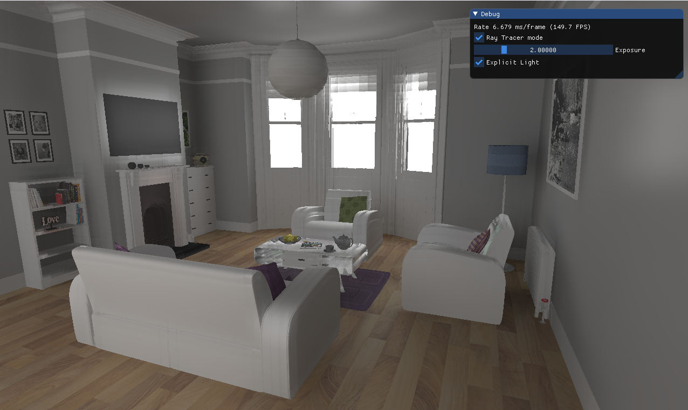

# CS398 Vulkan Real-Time Ray Tracing

> This project is used in the DigiPen **CS398/598** class only.

A real-time ray tracing renderer built with the Vulkan ray tracing extensions
(`VK_KHR_ray_tracing_pipeline` / `VK_KHR_acceleration_structure`), developed
incrementally as a series of course projects — from a scanline rasterizer up to
a Monte-Carlo path tracer with temporal accumulation and denoising.



## Features

- **Scanline pipeline** — classic rasterized preview pass (vertex/fragment shaders).
- **Hardware ray tracing** — ray generation / closest-hit / miss shaders running on
  a BLAS/TLAS acceleration structure built from the loaded scene.
- **Path tracing** — Monte-Carlo global illumination with:
  - GGX microfacet BRDF (GGX normal distribution + Smith G1 shadowing/masking)
  - Explicit light sampling (next-event estimation) toggle
  - Phong-exponent → GGX roughness conversion on model load
- **History (temporal accumulation)** — accumulates samples across frames for
  progressive convergence, with first-hit tracking for reprojection.
- **Denoising** — compute-shader denoise pass (`denoise.comp`) over the accumulated image.
- **Post pass** — exposure control and gamma (2.2) tonemapping.
- **ImGui UI** — FPS readout, ray tracer toggle, exposure slider, explicit-light toggle.
- **Model loading** — Assimp-based OBJ loader (sample scene: `living_room`),
  with emissive triangles collected into an emitter list for light sampling.

## Requirements

- **OS:** Windows x64
- **GPU:** ray-tracing-capable GPU with drivers supporting Vulkan ray tracing
  (`VK_KHR_ray_tracing_pipeline`)
- **Vulkan SDK:** 1.3.280.0
- **IDE:** Visual Studio 2022 (solution: `src/rtrt.sln`)

Third-party libraries are included in `libs/`: GLFW, GLM, Assimp, Dear ImGui, stb_image.

## Building & Running

1. Install the [Vulkan SDK](https://vulkan.lunarg.com/) 1.3.280.0.
2. Open `src/rtrt.sln` in Visual Studio.
3. Build and run the `rtrt` project (x64).

Shaders live in `src/shaders/` and compiled SPIR-V binaries in `src/spv/`.
To recompile a shader, run `glslangValidator` from the Vulkan SDK, e.g.:

```
glslangValidator -V --target-env vulkan1.2 src/shaders/raytrace.rgen -o src/spv/raytrace.rgen.spv
```

## Controls

| Input | Action |
|---|---|
| `W` / `A` / `S` / `D` | Move camera forward / left / back / right |
| `Space` / `C` | Move camera up / down |
| Left mouse drag | Look around (spin/tilt) |
| `Esc` | Quit |

UI options (ImGui window): toggle **Ray Tracer mode**, adjust **Exposure**,
toggle **Explicit Light** sampling.

## Project Structure

```
src/
├── app.cpp/.h            # GLFW window, main loop, ImGui UI, input handling
├── vkapp.cpp/.h          # Vulkan app core: instance/device/swapchain, frame submit
├── vkapp_fns.cpp         # Vulkan setup helpers (swapchain, resources, post pass)
├── vkapp_scanline.cpp    # Rasterized scanline pipeline
├── vkapp_raytracing.cpp  # Ray tracing pipeline + acceleration structures
├── vkapp_denoise.cpp     # Denoise compute pass
├── vkapp_loadModel.cpp   # Assimp model loading, materials, emitter list
├── camera.cpp/.h         # Camera movement + projection
├── acceleration_wrap.*   # BLAS/TLAS wrapper
├── descriptor_wrap.*     # Descriptor set wrapper
├── buffer_wrap.h / image_wrap.h
├── shaders/              # GLSL source (raygen, hit, miss, denoise, post, scanline)
├── spv/                  # Compiled SPIR-V
└── models/               # Test scenes (living_room)
```
